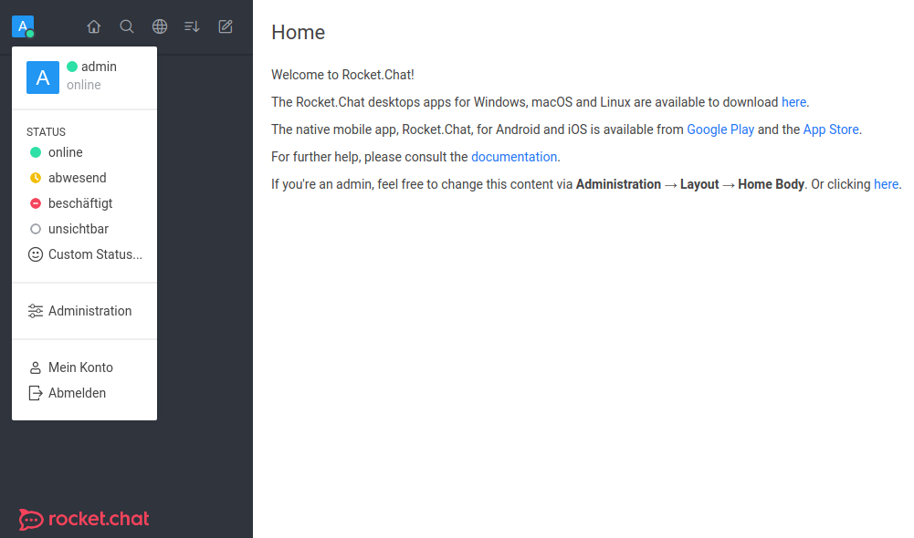

The techlab can be done with a local Docker setup.

<!-- or if you are attending a instructor lead lab you will use the hosted lab environment -->


## Local Docker Setup

The lab infrastructure is defined by an [docker-compose](https://docs.docker.com/compose/) file.


### Lab Components

The prepared docker-compose file defines following container to be started and connected:


* Jenkins master: jenkins
  * master server holding configuration and state
* Jenkins Slave: jenkins_slave_docker
  * slave to execute jobs
* Jenkins Slave with Docker daemon: docker
  * slave to execute jobs running inside container
* Rocket.Chat: rocketchat
  * chat to receive job state messages
* Rocket.Chat db: mongo
  * chat database
* Rocket.Chat db initializer: mongo-init-replica
  * chat database initializer container
  * will stop after completion
* Rocket.Chat bot: hubot:
  * chat bot


### Run Lab Infrastructure

1. Follow the instructions here to install [docker](https://docs.docker.com/get-docker/) and [docker-compose](https://docs.docker.com/compose/install/).
1. Check out the lab git repository: <https://github.com/puzzle/jenkins-techlab>

  ```s
  git clone https://github.com/puzzle/jenkins-techlab.git
  ```

1. Run all following commands from the root folder of the `jenkins-techlab` git repository.
1. **On first launch** Create ssh keys for master and slave:

  ```s
  source local_env/create-ssh-keys.sh
  ```

  > This creates two files, `local_env/agent/env_file` and `local_env/master/agent_connection_key`

1. Start with docker-compose. Depending on your docker installation you may need to run this with `sudo`:

  ```s
  docker-compose -f local_env/docker-compose.yml up -d --build
  ```

1. Check the state of the running components. Depending on your docker installation you may need to run this with `sudo`:

  ```s
  docker-compose -f local_env/docker-compose.yml ps
  ```

  > The hubot component is Restarting because of missing configuration.
  > Mongo-init-replica has Exit state. It is an init container ans stops after it's work is done.

1. Login to jenkins at <http://localhost:8080> with:
   * user: **default**
   * password: **default**


### Local Rocket.Chat Setup

Starting the local Docker setup for the first time, you must configure Rocket.Chat. Without that setup, the hubot container will restart endlessly.

Create a user for the hubot chat bot.

1. Login to Rocket.Chat at <http://localhost:3000> with:
   * user: **admin**
   * password: **admin**

1. Go to Administration

   

1. Go to Users and click the `New` button.

   

1. Create a User with following data:
   * Name: **bot**
   * Username: **bot**
   * Email: **bot@puzzle.ch**
   * Nickname: **bot**
   * Password: **botpassword**

1. Check the state of the running components. Depending on your docker installation you may need to run this with `sudo`:

  ```s
  docker-compose -f local_env/docker-compose.yml ps
  ```


## Pause and restart the lab

When you need a break and want to stop the containers to save resources, use docker-compose to stop the lab infrastructure.

1. Run all following commands from the root folder of the `jenkins-techlab` git repository.
1. Stop all containers:

  ```s
  docker-compose -f local_env/docker-compose.yml stop
  ```

Easily restart the infrastructure to continue the lab.

1. Run all following commands from the root folder of the `jenkins-techlab` git repository.
1. Start all containers:

  ```s
  docker-compose -f local_env/docker-compose.yml start
  ```

1. Check the state of the running components. Depending on your docker installation you may need to run this with `sudo`:

  ```s
  docker-compose -f local_env/docker-compose.yml ps
  ```


## Reset Lab Infrastructure

How to remove all infrastructure to start from scratch.

1. Stop and remove containers and volumes

   ```s
   docker-compose -f local_env/docker-compose.yml down -v
   ```

1. Check that all the lab volumes have been deleted.

   ```s
   docker volume ls
   ```

   The listed volumes should not start with `local_env_`. If you find such volumes, delete it manually (example for local_env_jenkins_master_home: `docker volume rm local_env_jenkins_master_home`).

1. Remove ssh key files:

   ```s
   rm local_env/agent/env_file
   rm local_env/master/agent_connection_key
   ```

<!--

## Hosted Lab Setup

The techlab setup involves starting a Jenkins Slave on your notebook and connecting it
to a Jenkins master running on an OpenShift 3 environment. An OpenShift client is needed
to establish the connection.

**Note** Lab 1.2 and 1.3 are used for [Lab 8](08_tools.md) and following.


### Task {}.1: Environment

Set environment variables with your techlab username and password:

```s
export TLUSER=MY_USER_NAME
export TLPASS=MY_PASSWORD
```


### Task {}.2: OpenShift Client

1. Follow the instructions here to install the OpenShift 3 client:
<https://docs.okd.io/latest/cli_reference/get_started_cli.html#installing-the-cli>

1. Log into OpenShift:

  ```s
  oc login https://openshift.puzzle.ch -u ${TLUSER} -p "${TLPASS}"
  ```

1. Forward the JNLP port required for Jenkins Master <-> Slave communication

  ```s
  oc project pitc-jenkins-techlab
  while oc port-forward `oc get pod -l name=jenkins -o jsonpath='{.items[0].metadata.name}'` 50000:50000 2222:2222; do :; done
  ```

The ``while`` loop  is required because currently port-forward connections time out after one hour.
Press ``CTRL-C`` ``CTRL-C`` to stop.


### Task {}.3: Jenkins Slave

There are two ways to deploy the Jenkins Slave:


#### with Docker

```s
docker run --net=host csanchez/jenkins-swarm-slave -master https://jenkins-techlab.ose3-lab.puzzle.ch/ -disableSslVerification -tunnel localhost:50000 -executors 2 -name ${TLUSER} -labels ${TLUSER} -username ${TLUSER} -password "${TLPASS}"
```


#### or directly on your machine or in a VM

1. Create a dedicated, unprivileged user:

  ```s
  sudo useradd jenkins-slave
  ```

1. Download Jenkins swarm client 3.4 into a location accessible by the new user:

  ```s
  curl -O https://repo.jenkins-ci.org/releases/org/jenkins-ci/plugins/swarm-client/3.4/swarm-client-3.4.jar
  ```

1. Start Jenkins slave with new user:

  ```s
  sudo -u jenkins-slave -i java -jar swarm-client-3.4.jar -master https://jenkins-techlab.ose3-lab.puzzle.ch/ -disableSslVerification -tunnel localhost:50000 -executors 2 -name ${TLUSER} -labels ${TLUSER} -username ${TLUSER} -password "${TLPASS}"
  ```

**Warning:** Running the Jenkins slave directly on your machine with your default user
will give techlab participants access to all your files.


### Task {}.4: Jenkins Folder

1. Login to the techlab [jenkins master](https://jenkins-techlab.ose3-lab.puzzle.ch/) with your techlab account.
1. Create a folder for your techlab projects by clicking "New Item" -> "Folder". Use your username
as the folder name. Click **Ok** and then **Save** on the following screen.

A folder provides a namespace for jobs, credentials and shared libraries. It's recommended
to use a separate folder per project to avoid name collisions and to group related jobs.
In this techlab this is required because each participant creates the same jobs, credentials and shared libraries.

-->
